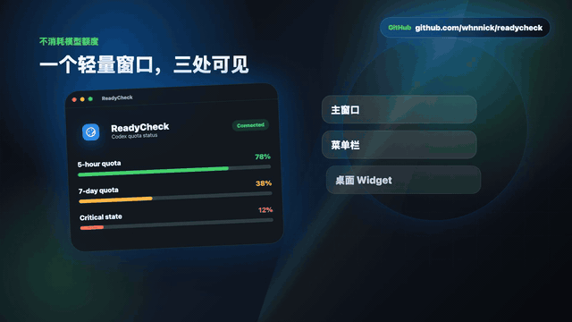

# ReadyCheck

[中文](README.zh-CN.md) | English

ReadyCheck is a macOS menu-bar and desktop-widget app for monitoring Codex subscription quota windows without sending model inference requests.

<p align="center">
  
</p>

> Status: `0.1.55` is an early macOS preview. Codex OAuth is the only supported provider in this release. Windows and other providers are planned, not included.

## What It Does

- Shows available Codex 5-hour and 7-day quota windows when the authorized usage response is parseable.
- Provides a main window, menu-bar summary, and optional draggable desktop widget.
- Refreshes usage data manually or every 1, 3, or 5 minutes. Refreshes are read-only usage requests and do not call model inference endpoints.
- Stores OAuth credentials in the macOS Keychain.
- Supports Simplified Chinese and English.

ReadyCheck fails closed: when quota data cannot be read or validated, it shows an unavailable state instead of estimating a percentage.

## Install

Download `ReadyCheck-0.1.55-macos.dmg` from the [latest release](https://github.com/whnnick/readycheck/releases/latest), open the DMG, and drag `ReadyCheck.app` to Applications.

The preview build is ad-hoc signed and not notarized. macOS may require you to confirm the first launch in **System Settings > Privacy & Security**. See [installation details](docs/INSTALL.md).

## Connect Codex

1. Open ReadyCheck and select **Connect**.
2. Complete the browser OAuth flow.
3. ReadyCheck receives the local callback and refreshes the available quota windows.

The OAuth callback listener uses `localhost:1455`. A manual callback URL field remains available if the local callback cannot be received.

## Build From Source

Requirements: macOS 14 or later, Xcode Command Line Tools, and Swift 6.

```bash
swift test
scripts/package_app.sh
scripts/package_dmg.sh
```

The DMG is written to `dist/ReadyCheck-0.1.55-macos.dmg`.

## Product Motion

The README preview is generated from the Remotion product intro in [`marketing/remotion`](marketing/remotion/README.md).

```bash
cd marketing/remotion
npm install
npm run dev
```

## Accuracy And Privacy

- The app reads the authorized Codex usage endpoint only. It does not use a prompt or model invocation to infer quota.
- The upstream usage response is an internal service interface and may change. ReadyCheck only displays percentages when its parser can validate both quota windows.
- OAuth tokens are stored in Keychain; do not put tokens, callback URLs, account IDs, or usage payloads in GitHub issues.
- This project is not affiliated with or endorsed by OpenAI.

## Documentation

- [Install guide](docs/INSTALL.md) | [安装说明](docs/INSTALL.zh-CN.md)
- [Real-world QA checklist](docs/QA.md) | [真实场景验收](docs/QA.zh-CN.md)
- [Release process](docs/RELEASE.md) | [发布流程](docs/RELEASE.zh-CN.md)
- [Contributing](CONTRIBUTING.md)
- [Security policy](SECURITY.md)
- [Changelog](CHANGELOG.md) | [更新日志](CHANGELOG.zh-CN.md)

## Feedback

Report defects or propose improvements through [GitHub Issues](https://github.com/whnnick/readycheck/issues). Please remove all account data and credentials before posting.

## License

Released under the [MIT License](LICENSE).
