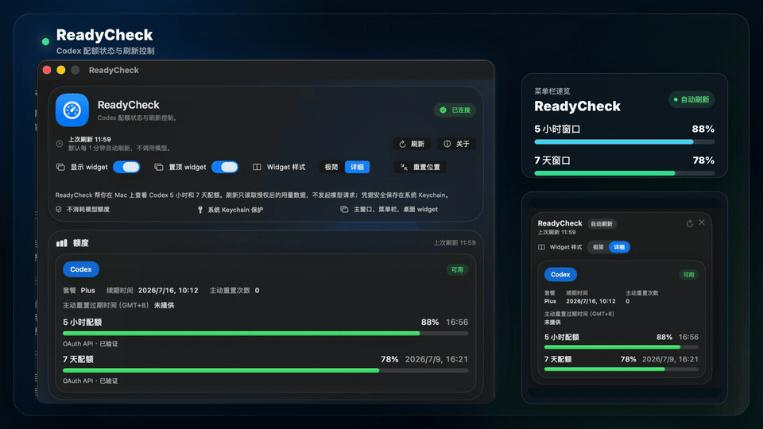

# ReadyCheck

[中文](README.zh-CN.md) | English

ReadyCheck is a macOS menu-bar and desktop-widget app for monitoring Codex subscription quota windows without sending model inference requests.

<p align="center">
  
</p>

> Latest release: [`0.1.132`](https://github.com/whnnick/readycheck/releases/tag/v0.1.132). Optional low-quota alerts, temporary widget hiding, visual style selection and data-status explanations. New features and recovery reminders are macOS-only.

**0.1.132 preview** also includes the launch-at-login installation checks from 0.1.131. See the [plan](docs/versions/0.1.132/PLAN.md) and [acceptance checklist](docs/versions/0.1.132/QA.md).

The **0.1.129 preview release** adapts the macOS edge rings and their details to the quota windows the account actually returns. A weekly-only account gets one ring; additional named windows stay distinct, and the capsule resizes after a refresh. See the [0.1.129 acceptance checklist](docs/versions/0.1.129/QA.md).

The **0.1.130 preview release** keeps every quota window in round-bubble details, with scrolling inside the existing panel. Primary quota selection applies to the bubble and notch; unavailable saved choices stay selected while the display temporarily falls back. See the [0.1.130 acceptance checklist](docs/versions/0.1.130/QA.md).

## What It Does

ReadyCheck **0.1.118** reads explicit ordinary-use permission through either the local Codex app-server or a separate OAuth usage response. A missing permission remains unknown even when quota percentages are available. See the [0.1.118 acceptance status](docs/versions/0.1.118/QA.md).

The **0.1.128 preview release** restores the daily Token chart and hover totals in separate OAuth mode when the local Codex app-server account matches the OAuth account. Without matching Token history, the chart continues to show local quota decreases in percentage points. See the [0.1.128 acceptance checklist](docs/versions/0.1.128/QA.md).

The bubble reads an icon from an installed Codex or ChatGPT app at runtime. Codex, ChatGPT, and their marks belong to OpenAI; ReadyCheck is independent and [follows OpenAI's brand guidance](https://openai.com/brand/).

- Shows the validated quota windows currently returned by Codex instead of assuming a fixed 5-hour or 7-day model.
- Shows the Credits balance or unlimited-credit state in the main window and detailed widget when the authorized usage response provides it.
- Uses the official local Codex app-server when available and signed in to the same account, including a 7/30/90-day account Token usage dashboard.
- Provides a main window, menu-bar summary, and optional draggable desktop widget.
- Adds an optional compact quota strip below the built-in display notch on supported Mac models.
- Refreshes promptly when the official local Codex app-server reports a quota change, while retaining manual and 1, 3, or 5 minute read-only refreshes as a fallback. These refreshes do not call model inference endpoints.
- Sends system reminders for an unused reset credit at 72, 48, 24, and 12 hours before expiration, or when exhausted quota begins consuming Codex Credits again.
- Keeps the local quota-decrease dashboard as a clearly labelled fallback when official Token history is unavailable.
- Stores OAuth credentials in the macOS Keychain.
- Supports Simplified Chinese and English.

ReadyCheck fails closed: when quota data cannot be read or validated, it shows an unavailable state instead of estimating a percentage.

## Automatic quota recovery reminders (macOS 0.1.98)

**Automatic recovery alerts** is on by default and always visible below quota in the main window and menu bar. A verified increase in any tracked window sends an alert, even before exhaustion. Consumption and unchanged refreshes do not notify. The first snapshot establishes a baseline. Keep ReadyCheck running; unobserved past recoveries are not replayed.

When the recovered quota starts decreasing again, ReadyCheck automatically removes its persistent recovery alert from Notification Center. A newer recovery replaces an older recovery alert, so completed reminders do not accumulate.

Turn the switch off to stop monitoring and cancel the current wait. The setting and active wait survive restarts; account changes discard the old account's wait. The control explains connection, data and delivery problems and links to system notification settings when alerts are disabled. The notification test button remains available after a test, with its result displayed separately.

Windows only shares the version number for this feature. See the [feature and black-box checklist](docs/QA.md#0193-automatic-recovery-interaction).

## Install

Download the published macOS DMG from the [latest release](https://github.com/whnnick/readycheck/releases/latest), open the DMG, and drag `ReadyCheck.app` to Applications.

For Windows 10/11 preview testing, download the published Windows portable ZIP from the same release, unzip it, and run `ReadyCheck.exe`.

The preview build uses a stable self-signed ReadyCheck identity but is not Developer ID signed or notarized. macOS may require you to confirm the first launch in **System Settings > Privacy & Security**. See [installation details](docs/INSTALL.md).

## Connect Codex

1. Open ReadyCheck and keep **Follow Codex on this Mac** selected to reuse the account signed in to Codex or ChatGPT on this Mac.
2. If the local app-server is unavailable, select **Sign in separately**, click **Connect**, and complete browser authorization.
3. ReadyCheck refreshes only the quota and usage data returned for that connection.

The OAuth callback listener uses `localhost:1455`. A manual callback URL field remains available if the local callback cannot be received.

## Build From Source

Requirements: macOS 14 or later, Xcode Command Line Tools, and Swift 6.

```bash
swift test
scripts/package_app.sh
scripts/package_dmg.sh
```

The development DMG is written to `dist/ReadyCheck-0.1.132-macos.dmg`; the Windows packaging script names its output `ReadyCheck-0.1.132-windows-x64-portable.zip`.

For a local GUI launch, run `scripts/build_and_run.sh`. It packages and opens a complete app under `.build/run`, separate from release staging. Install the packaged app in Applications before configuring login startup for daily use.

## Windows Preview Development

The Windows client has started as an Electron desktop app in [`apps/windows`](apps/windows/README.md). It currently includes the tray, main window, desktop widget, Codex OAuth, safe token storage, and read-only usage refresh. A portable zip is available for Windows 10/11 black-box testing, but there is no signed installer yet.

## Product Motion

The README preview is generated from the Remotion product intro in [`marketing/remotion`](marketing/remotion/README.md).

```bash
cd marketing/remotion
npm install
npm run dev
```

## Accuracy And Privacy

- The app prefers the official local Codex app-server and otherwise reads the authorized Codex usage endpoint. Neither path sends a prompt or invokes a model.
- Local mode binds reminder state to the official account ID when available. Standalone OAuth accepts app-server supplementation only for the matching OAuth account. The fallback usage response is an internal service interface and may change, so ReadyCheck displays only validated fields.
- OAuth tokens are stored in Keychain; do not put tokens, callback URLs, account IDs, or usage payloads in GitHub issues.
- This project is not affiliated with or endorsed by OpenAI.

## Documentation

- [0.1.130 Xiaohongshu campaign](docs/versions/0.1.130/PROMO.md) | [中文宣传素材](docs/versions/0.1.130/PROMO.zh-CN.md)
- [0.1.130 bubble detail and quota-selection acceptance](docs/versions/0.1.130/QA.md) | [中文验收](docs/versions/0.1.130/QA.zh-CN.md)
- [0.1.129 adaptive edge-ring acceptance](docs/versions/0.1.129/QA.md) | [中文验收](docs/versions/0.1.129/QA.zh-CN.md)
- [0.1.128 Token-chart recovery acceptance](docs/versions/0.1.128/QA.md) | [中文验收](docs/versions/0.1.128/QA.zh-CN.md) | [Version index](docs/VERSIONS.md)
- [0.1.127 icon consistency acceptance](docs/versions/0.1.127/QA.md) | [中文验收](docs/versions/0.1.127/QA.zh-CN.md) | [Version index](docs/VERSIONS.md)
- [0.1.126 C-icon acceptance](docs/versions/0.1.126/QA.md) | [中文验收](docs/versions/0.1.126/QA.zh-CN.md) | [Version index](docs/VERSIONS.md)
- [0.1.125 app-icon acceptance](docs/versions/0.1.125/QA.md) | [中文验收](docs/versions/0.1.125/QA.zh-CN.md) | [Version index](docs/VERSIONS.md)
- [0.1.124 account-source layout acceptance](docs/versions/0.1.124/QA.md) | [中文验收](docs/versions/0.1.124/QA.zh-CN.md) | [Version index](docs/VERSIONS.md)
- [0.1.123 edge-capsule color and hover acceptance](docs/versions/0.1.123/QA.md) | [中文验收](docs/versions/0.1.123/QA.zh-CN.md) | [Version index](docs/VERSIONS.md)
- [0.1.122 edge-capsule interaction acceptance](docs/versions/0.1.122/QA.md) | [中文验收](docs/versions/0.1.122/QA.zh-CN.md) | [Version index](docs/VERSIONS.md)
- [0.1.121 edge-ring proportion and motion acceptance](docs/versions/0.1.121/QA.md) | [中文验收](docs/versions/0.1.121/QA.zh-CN.md) | [Version index](docs/VERSIONS.md)
- [0.1.120 edge-ring recovery acceptance](docs/versions/0.1.120/QA.md) | [中文验收](docs/versions/0.1.120/QA.zh-CN.md) | [Version index](docs/VERSIONS.md)
- [0.1.119 edge-rail acceptance](docs/versions/0.1.119/QA.md) | [中文验收](docs/versions/0.1.119/QA.zh-CN.md) | [Version index](docs/VERSIONS.md)
- [0.1.118 OAuth availability acceptance](docs/versions/0.1.118/QA.md) | [中文验收](docs/versions/0.1.118/QA.zh-CN.md) | [Version index](docs/VERSIONS.md)
- [0.1.114 Account-source and motion acceptance](docs/versions/0.1.114/QA.md) | [中文验收](docs/versions/0.1.114/QA.zh-CN.md) | [Version index](docs/VERSIONS.md)
- [0.1.113 Floating-window mask acceptance](docs/versions/0.1.113/QA.md) | [中文验收](docs/versions/0.1.113/QA.zh-CN.md) | [Version index](docs/VERSIONS.md)
- [0.1.112 Bubble silhouette acceptance](docs/versions/0.1.112/QA.md) | [中文验收](docs/versions/0.1.112/QA.zh-CN.md)
- [0.1.111 Bubble corner acceptance](docs/versions/0.1.111/QA.md) | [中文验收](docs/versions/0.1.111/QA.zh-CN.md)
- [0.1.110 Bubble legibility acceptance](docs/versions/0.1.110/QA.md) | [中文验收](docs/versions/0.1.110/QA.zh-CN.md)
- [0.1.109 Widget spacing acceptance](docs/versions/0.1.109/QA.md) | [中文验收](docs/versions/0.1.109/QA.zh-CN.md)
- [0.1.108 shared quota-selection acceptance](docs/versions/0.1.108/QA.md) | [中文验收](docs/versions/0.1.108/QA.zh-CN.md)
- [0.1.107 display-spacing acceptance](docs/versions/0.1.107/QA.md) | [中文验收](docs/versions/0.1.107/QA.zh-CN.md)
- [0.1.106 display-controls acceptance](docs/versions/0.1.106/QA.md) | [中文验收](docs/versions/0.1.106/QA.zh-CN.md)
- [0.1.105 bubble-collapse acceptance](docs/versions/0.1.105/QA.md) | [中文验收](docs/versions/0.1.105/QA.zh-CN.md)
- [0.1.104 shape-transition acceptance](docs/versions/0.1.104/QA.md) | [中文验收](docs/versions/0.1.104/QA.zh-CN.md)
- [0.1.103 motion and glass acceptance](docs/versions/0.1.103/QA.md) | [中文验收](docs/versions/0.1.103/QA.zh-CN.md)
- [0.1.102 quota-switch acceptance](docs/versions/0.1.102/QA.md) | [中文验收](docs/versions/0.1.102/QA.zh-CN.md)
- [0.1.101 edge-tab acceptance](docs/versions/0.1.101/QA.md) | [中文验收](docs/versions/0.1.101/QA.zh-CN.md)
- [0.1.100 bubble acceptance](docs/versions/0.1.100/QA.md) | [中文验收](docs/versions/0.1.100/QA.zh-CN.md)
- [0.1.99 bubble plan](docs/versions/0.1.99/PLAN.md) | [中文计划](docs/versions/0.1.99/PLAN.zh-CN.md)

- [Install guide](docs/INSTALL.md) | [安装说明](docs/INSTALL.zh-CN.md)
- [Real-world QA checklist](docs/QA.md) | [真实场景验收](docs/QA.zh-CN.md)
- [Windows development plan](docs/WINDOWS.md) | [Windows 开发计划](docs/WINDOWS.zh-CN.md)
- [Windows black-box QA](docs/WINDOWS_QA.md) | [Windows 黑盒测试](docs/WINDOWS_QA.zh-CN.md)
- [Release process](docs/RELEASE.md) | [发布流程](docs/RELEASE.zh-CN.md)
- [Contributing](CONTRIBUTING.md)
- [Security policy](SECURITY.md)
- [Changelog](CHANGELOG.md) | [更新日志](CHANGELOG.zh-CN.md)

## Feedback

Report defects or propose improvements through [GitHub Issues](https://github.com/whnnick/readycheck/issues). Please remove all account data and credentials before posting.

## License

Released under the [MIT License](LICENSE).
