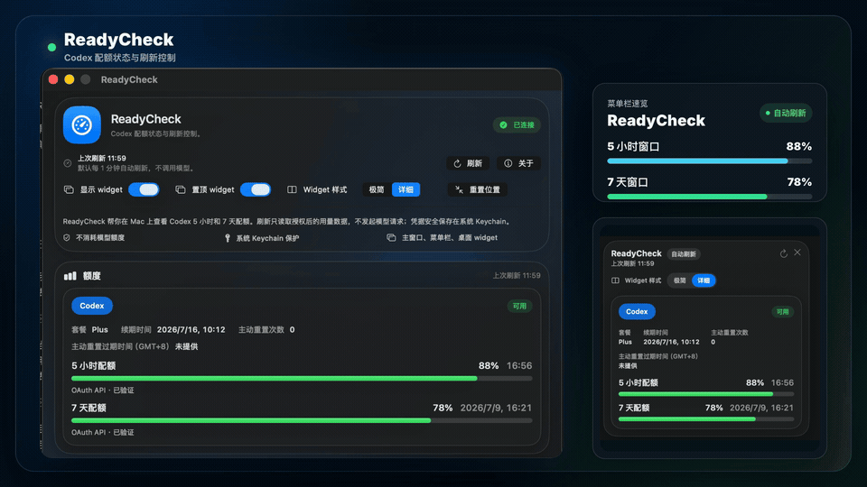

# ReadyCheck

[English](README.md) | 中文

ReadyCheck 是一款 macOS 菜单栏和桌面 widget 应用，用于查看 Codex 订阅额度窗口；刷新不会发送模型推理请求。

<p align="center">
  
</p>

> 当前状态：`0.1.76` 为 macOS 早期预览版。本版本仅支持 Codex OAuth；已提供 Windows 便携预览包，可用于 Windows 10/11 测试。

## 可以做什么

- 根据 Codex 当前实际返回动态展示经过验证的额度窗口，不预设固定为 5 小时或 7 天。
- 当已授权的用量数据提供对应字段时，在主窗口和详细 Widget 中显示 Codex Credits 余额或无限额度状态。
- 本机 Codex 已安装且登录同一账户时，优先使用官方 app-server，并提供 7/30/90 天账户 Token 使用看板。
- 提供主窗口、菜单栏摘要和可选的桌面悬浮 widget。
- 在支持的 Mac 内置刘海屏下方提供可选的紧凑额度状态条。
- 支持手动刷新以及每 1、3、5 分钟自动刷新。刷新只读取用量数据，不调用模型推理接口。
- 官方 Token 历史不可用时，保留明确标注的本地额度下降看板作为降级方案。
- OAuth 凭据存储在 macOS Keychain 中。
- 支持简体中文和英文。

ReadyCheck 采用保守策略：无法安全读取或验证额度数据时，显示不可用，而不会猜测百分比。

## 安装

从[最新发布页](https://github.com/whnnick/readycheck/releases/latest)下载 `ReadyCheck-0.1.76-macos.dmg`，打开 DMG 后将 `ReadyCheck.app` 拖入“应用程序”。

Windows 10/11 预览测试可从同一个发布页下载 `ReadyCheck-0.1.76-windows-x64-portable.zip`，解压后运行 `ReadyCheck.exe`。

当前预览构建使用稳定的 ReadyCheck 自签名身份，但尚未使用 Developer ID 签名或经过 Apple notarization。首次打开时，macOS 可能需要在“系统设置 > 隐私与安全性”中确认。详见[安装说明](docs/INSTALL.zh-CN.md)。

## 连接 Codex

1. 打开 ReadyCheck，点击“连接”。
2. 在浏览器完成 OAuth 授权。
3. ReadyCheck 接收本地回调并刷新可用额度窗口。

OAuth 回调监听 `localhost:1455`。若本地回调未成功接收，仍可手动粘贴回调 URL 完成授权。

## 从源码构建

要求：macOS 14 或更高版本、Xcode Command Line Tools、Swift 6。

```bash
swift test
scripts/package_app.sh
scripts/package_dmg.sh
```

DMG 输出到 `dist/ReadyCheck-0.1.76-macos.dmg`。

## Windows 预览版开发

Windows 客户端已作为 Electron 桌面应用在 [`apps/windows`](apps/windows/README.md) 启动。当前包含托盘、主窗口、桌面 widget、Codex OAuth、安全 token 存储和只读 usage 刷新；已提供便携版 zip 供 Windows 10/11 黑盒测试，但还没有签名安装器。

## 产品动效

README 预览动图从 [`marketing/remotion`](marketing/remotion/README.md) 的 Remotion 产品介绍视频生成。

```bash
cd marketing/remotion
npm install
npm run dev
```

## 准确性与隐私

- 应用优先使用官方本地 Codex app-server，否则读取已授权的 Codex 用量端点；两条路径都不会发送 prompt 或调用模型。
- 只有 app-server 的账户邮箱与 ReadyCheck OAuth 账户一致时才采用其数据。降级用量响应属于内部服务接口，可能变化，因此 ReadyCheck 只显示可以验证的字段。
- OAuth token 存储在 Keychain 中；提交 GitHub Issue 时不要包含 token、回调 URL、账户 ID 或原始用量数据。
- 本项目与 OpenAI 没有隶属或背书关系。

## 文档

- [安装说明](docs/INSTALL.zh-CN.md) | [Install guide](docs/INSTALL.md)
- [真实场景验收](docs/QA.zh-CN.md) | [Real-world QA checklist](docs/QA.md)
- [Windows 开发计划](docs/WINDOWS.zh-CN.md) | [Windows development plan](docs/WINDOWS.md)
- [Windows 黑盒测试](docs/WINDOWS_QA.zh-CN.md) | [Windows black-box QA](docs/WINDOWS_QA.md)
- [发布流程](docs/RELEASE.zh-CN.md) | [Release process](docs/RELEASE.md)
- [参与贡献](CONTRIBUTING.md)
- [安全策略](SECURITY.md)
- [更新日志](CHANGELOG.zh-CN.md) | [Changelog](CHANGELOG.md)

## 反馈

请通过 [GitHub Issues](https://github.com/whnnick/readycheck/issues) 报告问题或提出建议。提交前请移除所有账号数据和凭据。

## 许可证

本项目使用 [MIT License](LICENSE)。
